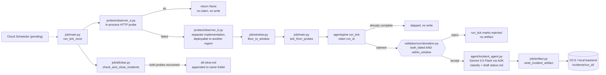

# Architecture: Tabclose



## Components and where they live

| Component | Path | What it is |
|---|---|---|
| Probe A | `probes/observer_a.py` | In-process HTTP probe against the target service. |
| Probe B | `probes/observer_b.py` | A separately implemented probe (own dataclass, own HTTP client). Runs in-process by default for local/offline mode; calls out to a standalone URL (`TABCLOSE_OBSERVER_B_URL`) when deployed as its own Cloud Function in a different region. |
| Window bucketing | `job/window.py` | `floor_to_window()` turns wall-clock time into a stable bucket string, so two ticks inside the same outage window compute the same `run_id`. |
| Validator | `validator/corroboration.py` | `CorroborationValidator`, an `agentspine.Validator`. Pure arithmetic: incident iff both probes report `ok=False` and their timestamps fall inside the same `window_seconds`. No model call. |
| Tick core | `job/main.py:tick_from_probes` | Network-free core: takes already-computed probe dicts, calls `agentspine.run_tick` with the corroboration validator and an `artifact_fn` that only runs on a passing verdict. This is what the offline test suite calls directly, exercising the identical code path Cloud Run runs. |
| Tick with real probes | `job/main.py:run_tick_once` | Calls the real probes, short-circuits with no write if Probe A is healthy, otherwise delegates to `tick_from_probes`. |
| Incident agent | `agent/incident_agent.py` | ADK agent backed by Gemini 3.5 Flash. Classifies the failure and drafts `status.md`. Called only from inside `tick_from_probes`'s `artifact_fn`, which `agentspine.run_tick` invokes only after the validator's verdict passes. |
| Artifact writer | `job/artifact.py` | `write_incident_artifact()`: writes `timeline.json`, both probes' evidence, and `status.md` to the configured backend (GCS or local, matching `agentspine.artifacts`). |
| All-clear path | `job/allclear.py` | `check_and_close_incidents()`: re-probes open incidents and writes `all-clear.md` into the same folder once both probes see recovery. Called every tick, independent of whether this tick found a new incident. |
| Demo target | `demo_target/app.py` | A small FastAPI app you can break on purpose so the demo cannot flake on a real third-party dependency. |

## Why the validator has veto power

`job/main.py:tick_from_probes` passes `CorroborationValidator` (wrapped to
inject the probe payloads into context) to `agentspine.run_tick`, which
calls `validator.verdict(context)` and only invokes `artifact_fn` (the
closure that calls `agent/incident_agent.py`) when `verdict.passed` is
true. `tests/test_agent_guard.py` asserts this directly: the agent path is
unreachable unless the validator has already passed. Deleting the
validator call, or hardcoding `passed=True`, is the delete-the-validator
test; `tests/test_verifier_red_green.py` performs exactly that break,
confirms the run is then wrongly accepted, and confirms restoring the
validator rejects it again.

## Why a Job, not a Service

`job/main.py` has no HTTP server. `main()` runs one tick to completion and
exits via `sys.exit(main())`. There is no code path where the process
outlives an HTTP response, because there is no HTTP response.

## Idempotency

`job/window.py:floor_to_window` and `agentspine.idempotency.compute_run_id`
together derive a deterministic `run_id` from `(service, window_start)`,
not from "now". `agentspine.run_tick`'s Firestore/in-memory claim makes a
second tick inside the same window a no-op:
`tests/test_corroboration_gate.py` and the idempotency tests in
the shared spine's own tests cover this and fail if the claim is bypassed.

## State model

Matches `DESIGN.md`, via `agentspine`'s shared `IdempotencyBackend`:

```
runs/{run_id}
  status: claimed | rejected | complete
  subject (service), window_start, window_end
  validator_verdict: {passed, reason}
  artifact_uri
```

No in-memory session state. `agent/incident_agent.py` is called fresh per
tick; anything that must survive past one tick goes through
`agentspine`'s Firestore-backed idempotency and artifact backends, not ADK
session state.
